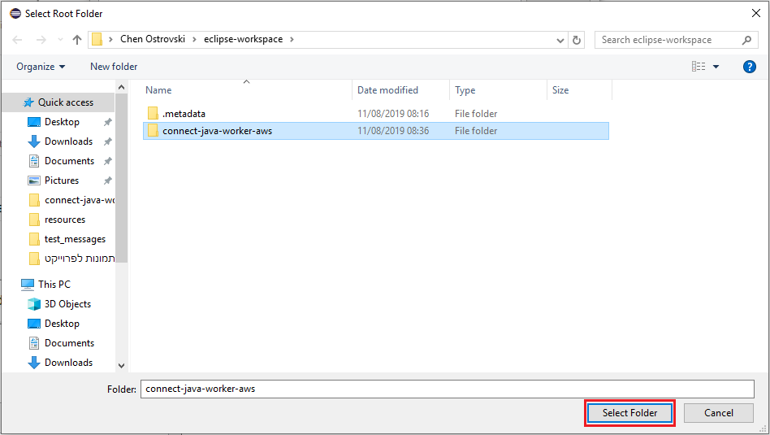

# Eclipse installation 

The [IntelliJ IDE](https://www.jetbrains.com/idea/)
(community or ultimate editions) can also be
used with this example.

**Step 1.** Download or clone the
[connect-java-worker-aws](https://github.com/docusign/connect-java-worker-aws)
   repository

**Step 2.** Start Eclipse click on **File** at the top left corner
 and choose the **Import** option.

**Step 3.** Click on the **Maven** directory and choose the **Existing Maven Projects** option.
Then Click **Next >**

**Step 4.** Click on **Browse** and search for the repository

**Step 5.** Once you have found the repository, choose it and click on **Select Folder**

**Step 6.** Make sure you chose the right repository
 and mark the **/pom.xml** if its not marked yet.
 
 **Step 7.** Click **Finish**.

**Step 8.** The project will be displayed in the **Project Explorer**.

## Configuring the project
Configure the example as discussed in the repository's Readme.

You can use the IDE to edit the
`/src/main/resources/config.properties` file.

## Running or debugging the example

The Main class of this project is **AWSWorker.java**.

The Eclipse toolbar contains icons for Running and for debugging the example:

The left insect-shaped icon is used for Debugging and the right round icon is used for Run the example.

In order for them to work, you **have** to use them from the **AWSWorker.java** class.

## Configuring the example via environment variables
Instead of the config.properties file, environment variables
can be used.

The IntelliJ's **Run Configuration** screen can be used to
set the environment variables. Unfortunately, the IDE
[does not support multi-line environment variables](https://youtrack.jetbrains.com/issue/IDEA-185315).

As a work-around, the private key can be entered into
the IDE as a single line. Before doing so, append `\n\`
to each line of the private key.
